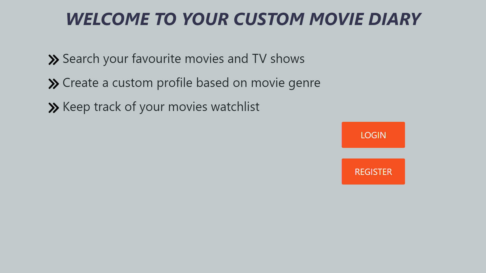
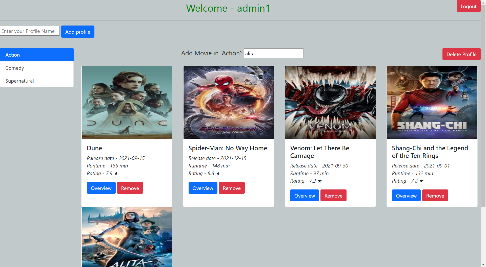

<!-- PROJECT LOGO -->
<br />
<div align="center">
<h3 align="center">Movies Diary</h3>

  <p align="center">
    A personal movie watchlist
</div>


<!-- TABLE OF CONTENTS -->
<details>
  <summary>Table of Contents</summary>
  <ol>
    <li>
      <a href="#about-the-project">About The Project</a>
      <ul>
        <li><a href="#built-with">Built With</a></li>
      </ul>
    </li>
    <li>
      <a href="#getting-started">Getting Started</a>
      <ul>
        <li><a href="#prerequisites">Prerequisites</a></li>
        <li><a href="#installation">Installation</a></li>
      </ul>
    </li>
    <li><a href="#usage">Usage</a></li>
    <li><a href="#contact">Contact</a></li>
  </ol>
</details>


<!-- ABOUT THE PROJECT -->
## About The Project

Movie Diary is a convenient way to keep track of your movies watchlist. Keep track of which movies you want to see later. Create custom profiles based on genre, name of friend who recommended you etc. and add movies for easier access.
Get the details of the movies e.g. Overview, rating, release date, runtime.

<p align="right">(<a href="#top">back to top</a>)</p>


### Built With

* [Node.js](https://nodejs.org/)
* [Express.js](https://expressjs.com/)
* [MongoDB](https://www.mongodb.com/)
* [Bootstrap](https://getbootstrap.com)

<p align="right">(<a href="#top">back to top</a>)</p>


<!-- GETTING STARTED -->
## Getting Started

Clone this project via - ```https://github.com/Devanshu1999/Movies_Diary.git``` OR simply download as a zip and extract.

### Prerequisites

Node and MongoDB are required for this project. Refer [Node.js](https://nodejs.org/) and [MongoDB](https://www.mongodb.com/)

### Installation

1. Get a free API Key from [TMDB_API](http://developers.themoviedb.org/)
2. Install NPM packages
   ```sh
   npm install
   ```
3. Create a file named ```.env``` and enter the (key,value) pairs (NOTE:- No spaces are allowed here):
   ```
   PORT=YourExpressPort(Usually_3000)
   TMDB_API_KEY=YourAPIKeyAfterFreeRegistration
   MONGODB_URL=mongodb://127.0.0.1:27017/movies-tracker(EXAMPLE)
   JWT_SECRET=SecretForMoviesTrackerApp.(UseAnyString)
   ```
4. To run - ```npm start``` or install [nodemon](https://nodemon.io/) and use ```npm run dev```
<p align="right">(<a href="#top">back to top</a>)</p>


<!-- USAGE EXAMPLES -->
## Usage

<a href="https://github.com/github_username/repo_name">
    
</a>
<a href="https://github.com/github_username/repo_name">
    
</a>

<p align="right">(<a href="#top">back to top</a>)</p>


<!-- CONTACT -->
## Contact

Devanshu Verma - devanshuverma1234@gmail.com | [LinkedIn](linkedin.com/in/DevanshuVerma99)

<p align="right">(<a href="#top">back to top</a>)</p>

